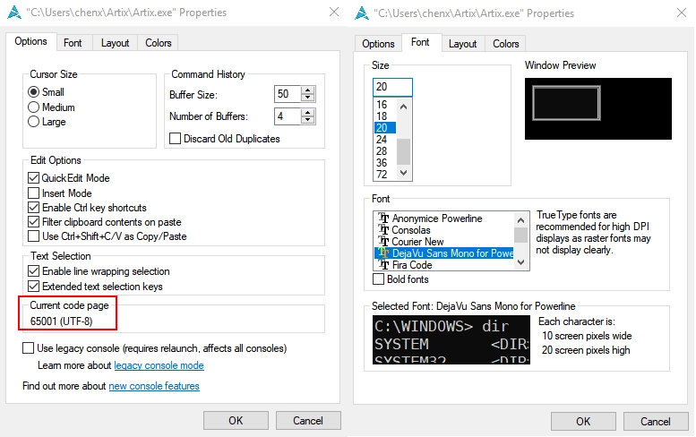
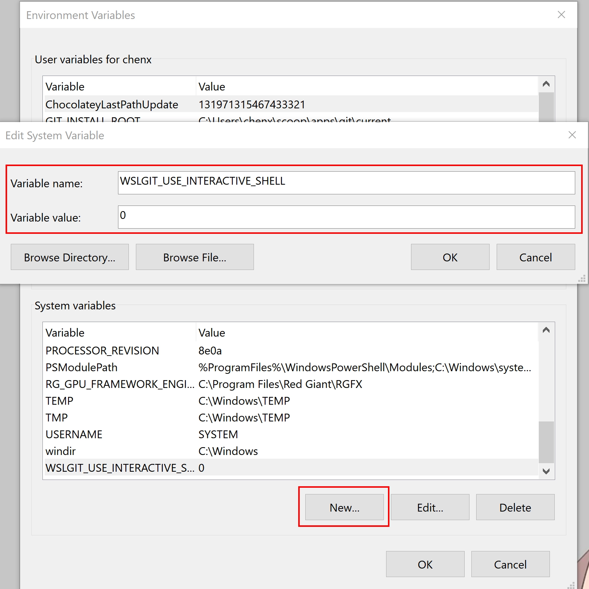
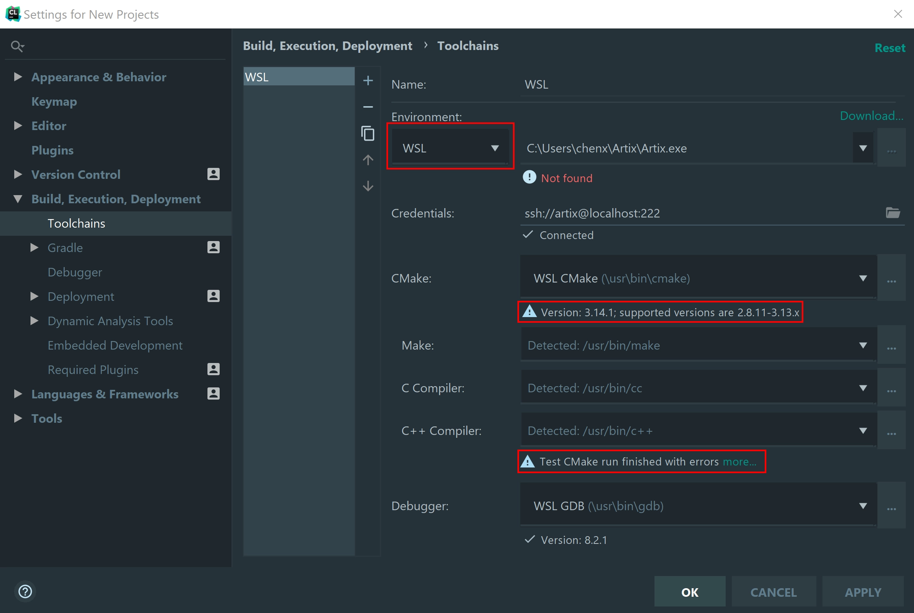
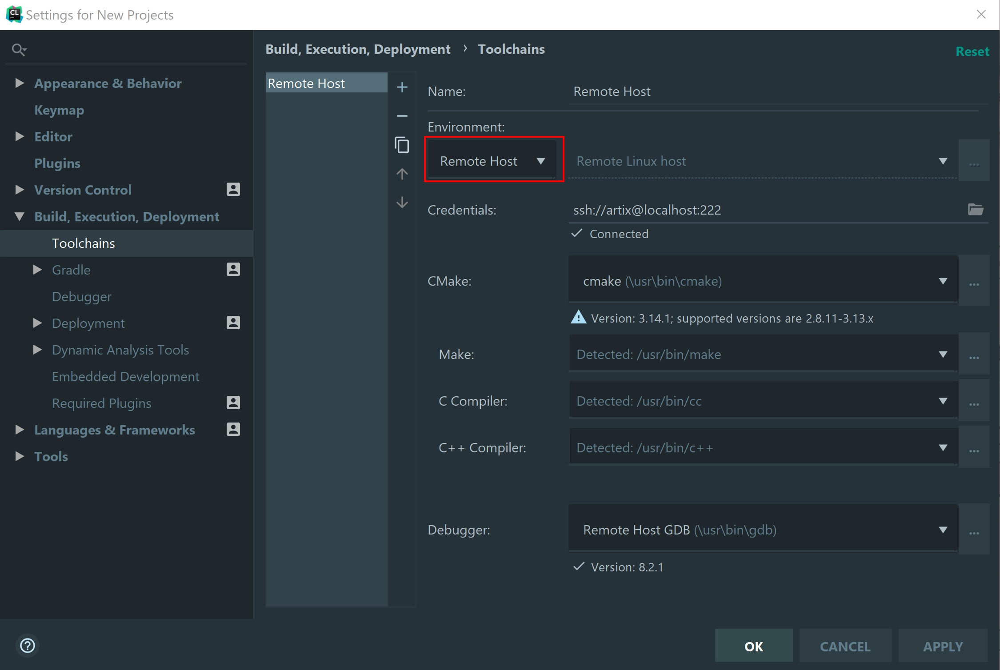
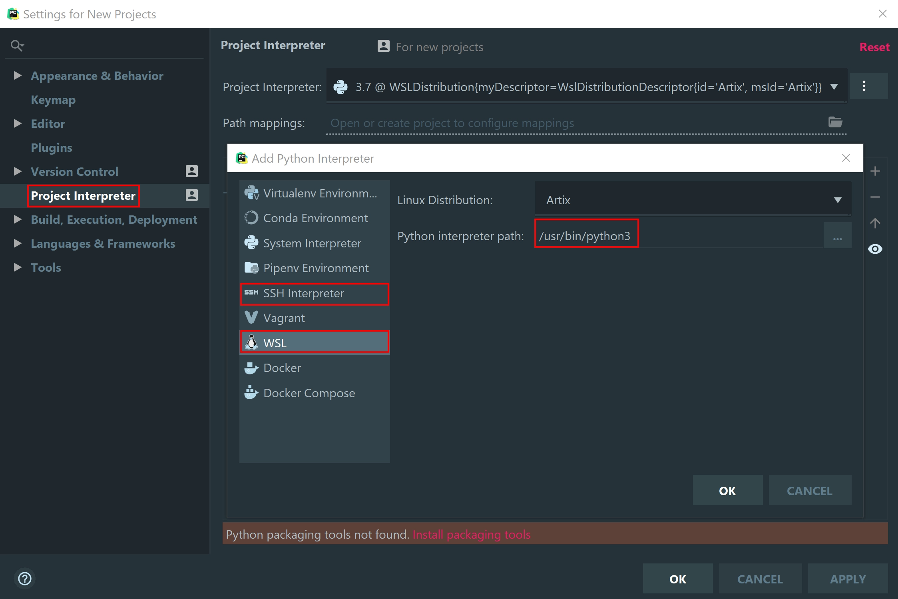
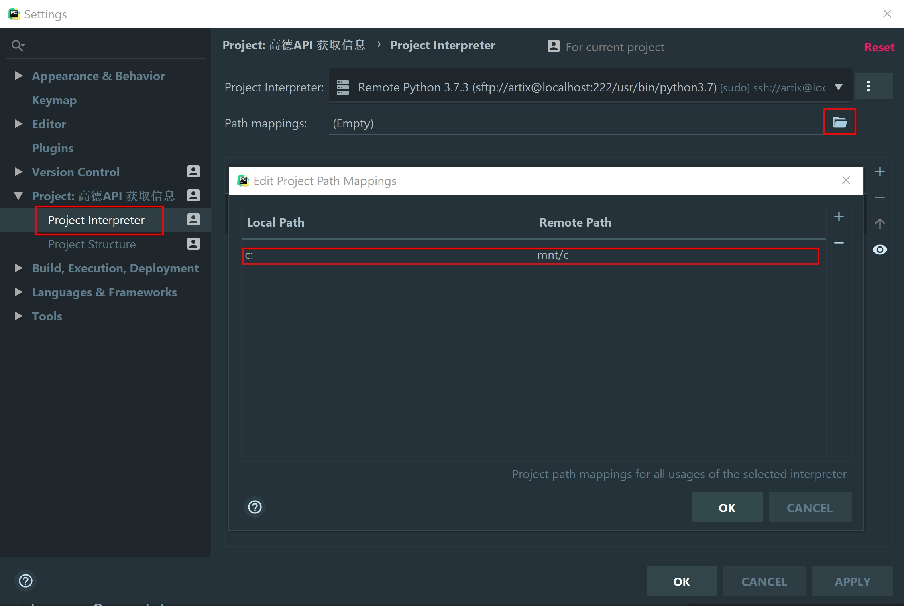
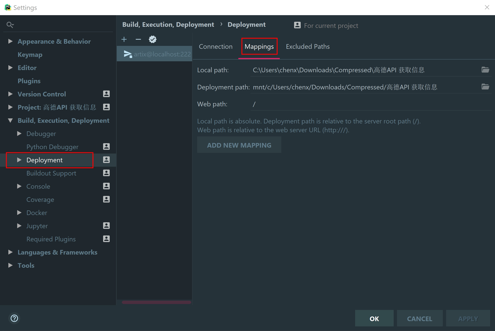
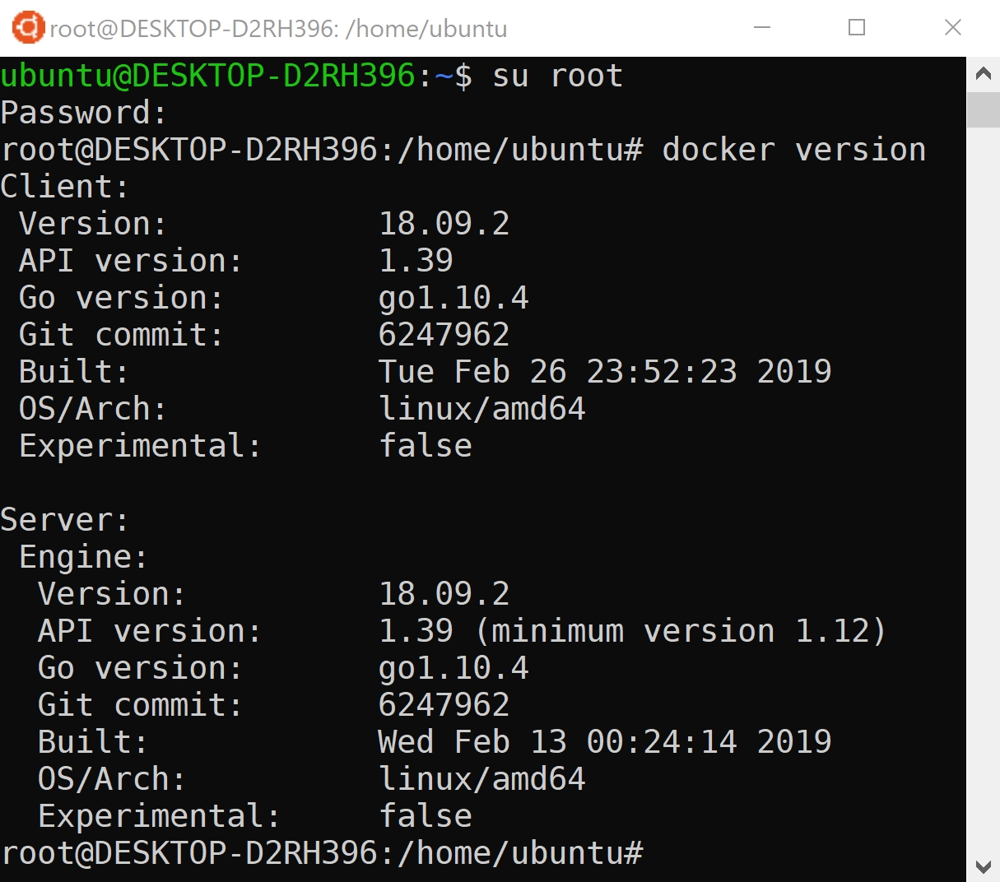

---

title: "Use Wsl to Build a Development Environment"
subtitle: "Develop gracefully on Windows"
summary: "Summarize my experience in configuring WSL"
date: 2019-04-12T21:51:30+08:00
draft: false

authors: ["YXL"]
tags: ["WSL", "Windows", "Software"]
categories: ["System"]

avatar: false
bio: true

image:
  name: "【オリジナル】「桜」「ももこ」[pid=73718366].jpg"
  caption: "Image credit: [**ももこ**](https://www.pixiv.net/member_illust.php?mode=medium&illust_id=73718366)"

toc:
  enable: true
  heading: "h2, h3"

anchor:
  enable: true
  list:
  - placement: "right"
    visible: "hover"
    icon: "f838"
    element: ["h1", "h2", "h3", "h4", "h5", "h6"]
  - placement: "left"
    visible: "hover"
    icon: "f1dd"
    element: ["p"]

---

[](https://app.netlify.com/sites/yxl-blog/deploys)



## Introduction

---

### What is WSL?

The Windows Subsystem for Linux (WSL) is a new Windows 10 feature that enables you to run native Linux command-line tools directly on Windows, alongside your traditional Windows desktop and modern store apps.

### What are the advantages of WSL?

- WSL requires  `fewer resources`  (CPU, memory, and storage) than a full virtual machine.
- WSL allows you to run  `Linux command-line tools` and apps alongside your Windows command-line, desktop and store apps, and to access your Windows files from within Linux.
- `Bash support`  strengthens the value of the command-line on Windows, allowing PowerShell to leverage other popular technologies.
- WSL shares the  `IP address`  of Windows.

### Which linux distributions have I used?

- Official support: 
  - [Ubuntu](https://www.microsoft.com/en-us/p/ubuntu/9nblggh4msv6?activetab=pivot:overviewtab)
  - [Debian](https://www.microsoft.com/en-us/p/debian/9msvkqc78pk6?activetab=pivot:overviewtab)
  - [openSUSE Leap 42](https://www.microsoft.com/en-us/p/opensuse-leap-42/9njvjts82tjx#activetab=pivot:overviewtab)
- Community support:
  - [ArchWSL](https://github.com/yuk7/ArchWSL)
  - [ArtixWSL](https://github.com/hdk5/ArtixWSL)
  - [AlpineWSL](https://github.com/yuk7/AlpineWSL)

In the end, I choose to use  `ArtixWSL`  and  `Ubuntu`  in this tutorial.

The reasons are as followed.

- Why not?
  - `Debian` : It is very good, but the software is too old.
  - `openSUSE Leap 42` : I am not very familiar with it, and need to work with the graphical interface to be more useful.
  - `ArchWSL` : Neither installing `VScode` nor `atom` will work properly. According to [issues](https://github.com/Microsoft/WSL/issues), this may be caused by `electron` (I'm not sure).
  - `AlpineWSL` : It is more suitable for deployment on small equipment, not for development.
- Why?
  - `Ubuntu` : A `WSL` with the largest number of users and the most relevant tutorials is not easy to make mistakes. (But I hate it very much)
  - `ArtixWSL` : The derivative version of `Arch Linux` can get a similar experience without problems.
  
## Preparation

---

### Installation

- [Install Windows Subsystem for Linux (WSL) on on Windows 10 | Microsoft Docs](https://docs.microsoft.com/en-us/windows/wsl/install-win10)
- [ArtixWSL/README.md](https://github.com/hdk5/ArtixWSL/blob/master/README.md)

### Package manager

Recommended open source mirror station:

- [Alibaba Open Source Mirror Site](https://opsx.alibaba.com/mirror?lang=en-US)
- [Tsinghua Open Source Mirror](https://mirrors.tuna.tsinghua.edu.cn/)

WSL path: 
`%\HOMEPATH%\AppData\Local\Packages\CanonicalGroupLimited.UbuntuonWindows_79rhkp1fndgsc\LocalState\rootfs`

It is best not to modify the file under `Windows`. For details, please see [here](https://blogs.msdn.microsoft.com/commandline/2016/11/17/do-not-change-linux-files-using-Windows-apps-and-tools/).

- Ubuntu:

``` Bash {linenos=table}
sudo vim /etc/apt/sources.list
# Modify the file according to the prompts of the open source station
sudo apt-get update && sudo apt-get upgrade  # Update
```

- Aritx:

``` Bash {linenos=table}
vim /etc/pacman.d/mirrorlist
# Modify the file according to the prompts of the open source station
vim /etc/pacman.conf  # Open the settings file
# Modify SigLevel = Never
pacman -Syu  # Update
pacman -S base git openssh sudo binutils wget  # Install the base components
```

### Terminal Environment

Install `zsh` to replace `Bash`.

``` Bash {linenos=table}
sudo apt install zsh  # Ubuntu
sudo pacman -S zsh  # Artix
sudo chsh -s $(which zsh)  # Use zsh as the default shell environment (optional)
```

Install `oh-my-zsh` to make the terminal more beautiful.

``` Bash {linenos=table}
sh -c "$(curl -fsSL https://raw.githubusercontent.com/robbyrussell/oh-my-zsh/master/tools/install.sh)"
```

Please refer to [here](https://github.com/robbyrussell/oh-my-zsh) for the settings of `oh-my-zsh`.

You may find that the font does not display properly. For the normal display of the font, we also need to do the following.

1. Enter `Control Panel` in the Explorer.
2. `Region` - `Administrative` - `Change system locale`

3. `win + r` ， Enter `regedit`.
4. Go to `Computer\HKEY_CURRENT_USER\Console`.
5. Find your terminal and add a `REG_DWORD` with the name `CodePage` and a value of `fde9`.
6. Install [Powerline Fonts](https://github.com/powerline/fonts) or [Programmer Font](https://github.com/adobe-fonts/source-code-pro) or [Awesome-Powerline Fonts](https://github.com/gabrielelana/awesome-terminal-fonts) or [Nerd-Fonts](https://github.com/ryanoasis/nerd-fonts).
7. Right click on the terminal - `Properties` to view the current encoding and modify the font.


### ssh

Add `Port 222` and `PasswordAuthentication yes` to `/etc/ssh/sshd_config`.

``` Bash {linenos=table}
# The following is only for Artix
sudo ssh-keygen -t dsa -f /etc/ssh/ssh_host_dsa_key
sudo ssh-keygen -t rsa -f /etc/ssh/ssh_host_rsa_key
sudo ssh-keygen -t ecdsa -f /etc/ssh/ssh_host_ecdsa_key
sudo ssh-keygen -t ed25519 -f /etc/ssh/ssh_host_ed25519_key
```

start `ssh` 。

``` Bash {linenos=table}
sudo /usr/bin/sshd -D  # Artix
sudo service ssh start  # Ubuntu
```

### Git

``` Bash {linenos=table}
git config --global user.name "username"  # username
git config --global user.email "email"  # email
git config --global http.proxy 'socks5://127.0.0.1:$端口号'  # HTTP proxy (optional)
git config --global https.proxy 'socks5://127.0.0.1:$端口号'  # HTTPS proxy (optional)
```

### AUR helper

<font size=3> *The following operations are only for `Artix`* </font>

<font size=3> *Please install the C++ environment first* </font>

The complete [AUR helper list](https://wiki.archlinux.org/index.php/AUR_helpers), I choose `yay` for a simple reason - it is written in the `Go` language.

`AUR helper` does not run under the `root` user, so let's create a new user first.

``` Bash {linenos=table}
# Create a user named artix
useradd -m -g users -G wheel -s /bin/bash artix
# Set the password for artix
passwd artix
# Set artix to root group
sudo vim /etc/sudoers
# Add a new line
artix ALL=(ALL) ALL
# Switch user
su - artix
```
install `yay`.

``` Bash {linenos=table}
sudo chmod a+r /etc/pacman.conf
sudo chmod a+r /etc/pacman.d/mirrorlist
git clone https://aur.archlinux.org/yay.git
cd yay
makepkg -si
```

## Use zsh/bash instead of windows terminal

---

I want to execute `bash` in `windows`, the format is as follows.

``` Bash {linenos=table}
bash -c "sudo apt-get update"
```

To execute the `windows` program in `bash/zsh`, just add `.exe` to the end.

``` Bash {linenos=table}
ipconfig.exe
```

It's time to discard `cmd` and <del>`Powershell`</del>.

## Develop under Winodws

---

### Environmental Installation

- C/C++

``` Bash {linenos=table}
sudo apt-get install build-essential cmake gcc clang gdb lldb  # Ubuntu
sudo pacman -S make cmake gcc clang gdb lldb  # Artix
```

- Python

``` Bash {linenos=table}
sudo apt-get install python3 python3-pip  # Ubuntu
sudo apt-get install python python-pip
sudo pacman -S python python-pip python-pipenv  # Artix
sudo pacman -S python2 python2-pip python2-pipenv
```

``` Bash {linenos=table}
# Common package (optional)
sudo apt-get install python-scipy python-numpy python-matplotlib python-pandas  # Ubuntu
sudo pacman -S python-scipy python-numpy python-matplotlib python-pandas   # Artix
```

- Node.js

``` Bash {linenos=table}
sudo apt-get install npm yarn nodejs  # Ubuntu
sudo pacman -S npm yarn nodejs  # Artix
```

However, I do not recommend this installation method. It is recommended to use [nvm](https://github.com/creationix/nvm#installation-and-update).

### VSCode

- Git

Using [WSLGit](https://github.com/andy-5/wslgit), we can use `Git for linux` on the Windows side.

Once the download is complete, open `settings.json`.

``` json {linenos=table}
{
  "git.path": "C:\\CHANGE\\TO\\PATH\\TO\\wslgit.exe"
}
```

Add a value `WSLGIT_USE_INTERACTIVE_SHELL` to the environment variable and set it to `0` or `false`. This will not call `Shell` when used, improving efficiency.



- C/C++

I believe that most people have used tools like `MSYS2` and `Cygwin`. The configuration of WSL is similar. Just add the pipe-program and path-mapping in `launch.json`.

``` json {linenos=table}
{
  "pipeTransport":  {
    "pipeCwd": "",
    "pipeProgram": "c:\\windows\\sysnative\\bash.exe",
    "pipeArgs": ["-c"],
    "debuggerPath": "/usr/bin/gdb"
  },
  "sourceFileMap":  {
    "/mnt/c": "c:\\"
  },
}
```

Also make sure that the value of `externalConsole` is `flase` , otherwise debugging will not work.

- Python

The current official plugin is on the way: [Issue #68293](https://github.com/Microsoft/vscode/issues/68293).

A viable solution comes from [here](http://blog.plusls.cn/windows/vscode-using-python-in-wsl/).

### Clion

`Clion 2018` will be able to support `WSL`. If you are using a third-party distribution, please open `%\HOMEPATH%\.CLion2019.1\config\options\wsl.distributions.xml` and at the same time open the registry and go to `Computer\HKEY_CURRENT_USER\Software\Microsoft\Windows\CurrentVersion\Lxss\` and make sure that both `ID` and `path` are the same.


And make sure the following plugins are turned on.


Select `WSL` in `Environment` in `Toolchains` to enable the `ssh` connection.


But unfortunately, if you are using `Artix`, this doesn't work.



We can only use WSL as a remote host.



There is no significant difference in efficiency between the two methods, but using `Remote Host` will generate temporary files.

### PyCharm

The setting of `PyCharm` is the same as `Clion`, modify `%\HOMEPATH%\.PyCharm2019.1\config\options\wsl.distributions.xml`.

There are also two options in `Project Interpreter`.



If you use `Remote Host`, you need to set the path mappings.



But if your path contains Chinese, this may result in an error, because it uses the `ASCII` character.

The solution is to set `Mappings` in `Development`.



## Develop under WSL

---

To develop under WSL, you must have a graphical interface. Although the official has never officially supported GUI applications, it has been proven by countless people to be viable (although a lot of mistakes will be reported).

We will use [X Window System](https://en.wikipedia.org/wiki/X_Window_System). It contains `X Server` and `X Client`.

### X Server

I have used [Xming](https://xming.en.softonic.com/), [VcXsrv](https://sourceforge.net/projects/vcxsrv/), [MobaXterm](https://mobaxterm.mobatek.net/), [X410](https://www.microsoft.com/en-us/p/x410/9nlp712zmn9q?activetab=pivot:overviewtab).

The best experience is `X410`, which allows me to experience the smoothness of a near-native system. The official description is as follows.

> X410 utilizes the source codes from the X.Org open-source project. However, unlike other products from different companies, we've removed the dependencies on Cygwin libraries and streamlined the codes.

Unfortunately, this is a paid software. I recommend to use free trial before you decide whether to buy it.

Free software I recommend `VcXsrv`.

### X Client

``` Bash {linenos=table}
sudo apt-get install xorg  # Ubuntu
sudo pacman -S xorg xorg-xinit  # Artix
```
Then you can install the GUI application.

### VSCode

Visual Studio Code is my preference, because I can't find another software that can be both lightness like the Editor and powerful of the IDE.

``` Bash {linenos=table}
# Ubuntu
sudo add-apt-repository ppa:ubuntu-desktop/ubuntu-make  # Add source
sudo apt-get update  # Update list
sudo apt-get install ubuntu-make
umake web visual-studio-code
```

``` Bash {linenos=table}
# Artix
# Choose one of them, it is recommended to use yay installation
pacman -S code
yay -S visual-studio-code-bin
```

Then you can start `VSCode`.

``` Bash {linenos=table}
DISPLAY=:0 code  # short of DISPLAY=localhost:0 code
sudo DISPLAY=:0 code --user-data-dir  # Run as an root in order to be able to use git
# You can write the DISPLAY parameter to .profile so you don't have to write it every time.
echo 'export DISPLAY=:0.0' >> .profile
```

### Chinese Font Installation

After opening, it is found that Chinese displays garbled characters. For this we need to install Chinese fonts.

The installation in `Artix` is very simple.

``` Bash {linenos=table}
# This is the three fonts I recommend.
sudo pacman -S adobe-source-han-sans-cn-fonts
sudo pacman -S adobe-source-han-serif-cn-fonts
sudo pacman -S noto-fonts-cjk
```

The installation in `Ubuntu` is more troublesome. An opportunistic approach is to add `C:\Windows\Fonts` to the font directory. However, during use, I found that this would affect the font display under `Windows` and even cause the software to crash.

The correct way to do this is to move the font file to the `Ubuntu` directory and create a font index. You can refer to [here](https://wiki.ubuntu.com/Fonts#Manually).

Open `settings.json` in VSCode for a simple configuration. My configuration is as follows.

``` json {linenos=table}
{
  "window.titleBarStyle": "custom",
  "editor.fontSize": 20,
  "editor.fontFamily": "'Source Code Pro', 'Source Code Pro Black', 'Source Code Pro Light', 'Source Code Pro Medium', 'Source Code Pro ExtraLigh', 'Source Code Pro Semibold'",
  "terminal.integrated.cursorBlinking": true,
  "terminal.integrated.fontFamily": "'DejaVuSansMono Nerd Font Mono', 'DejaVuSansMono Nerd Font', 'SauceCodePro Nerd Font Mono', 'SauceCodePro Nerd Font'",
  "terminal.integrated.fontSize": 16, 
}
```

The fonts involved are

其中涉及到的字体：
``` Bash {linenos=table}
yay -S nerd-fonts-source-code-pro
yay -S nerd-fonts-dejavu-complete
# choose one of two
sudo pacman -S adobe-source-code-pro-fonts
npm install git://github.com/adobe-fonts/source-code-pro.git#release
```

### Jupyter Notebook

- Installation

``` Bash {linenos=table}
# python3
python3 -m pip install --upgrade pip 
python3 -m pip install --upgrade pip -i https://pypi.tuna.tsinghua.edu.cn/simple  # Use Tsinghua Source
python3 -m pip install jupyter
python3 -m pip install jupyter -i https://pypi.tuna.tsinghua.edu.cn/simple  # Use Tsinghua Source
# python2
python -m pip install --upgrade pip
python -m pip install --upgrade pip -i https://pypi.tuna.tsinghua.edu.cn/simple  # Use Tsinghua Source
python -m pip install jupyter
python -m pip install jupyter -i https://pypi.tuna.tsinghua.edu.cn/simple  # Use Tsinghua Source
```

- Running

``` Bash {linenos=table}
jupyter notebook
sudo jupyter notebook --allow-root  # Run as an root
```

I mentioned Windows and WSL shared network ports before, so open `http://localhost:8888` directly under Windows.


- C/C++ (optional)

<font size=3> *Compilation takes a long time and takes up a lot of space* </font>

Install `Cling`.

``` Bash {linenos=table}
wget https://raw.githubusercontent.com/root-project/cling/master/tools/packaging/cpt.py
chmod +x cpt.py
./cpt.py --check-requirements && ./cpt.py --create-dev-env Debug --with-workdir=./cling-build/
```

Add the `Cling` kernel to `Jupyter Notebook`.

``` Bash {linenos=table}
export PATH=/cling-install-prefix/bin:$PATH
cd /cling-install-prefix/share/cling/Jupyter/kernel

pip3 install -e

jupyter-kernelspec install [--user] cling-cpp17
jupyter-kernelspec install [--user] cling-cpp1z
jupyter-kernelspec install [--user] cling-cpp14
jupyter-kernelspec install [--user] cling-cpp11
```

Software such as `Eclipse` and `Clion` can also be used, but I will not introduce it here.

## High Level Operation

---

### GUI Software for ssh Connection

Add `X11Forwarding yes` to `/etc/ssh/sshd_config` to enable `X Server`.

The desktop environment I installed has `xfce4`, `mate`, `ghome`, `dde`, of which the first three perform well, but `dde` does not work properly in debian and Ubuntu. One possible solution comes from [Issue #637](https://github.com/Microsoft/WSL/issues/637).

After the installation is successful, it can be opened in the terminal.

``` Bash {linenos=table}
DISPLAY=:0 xfce4-session  # xfce4
DISPLAY=:0 mate-session  # mate
DISPLAY=:0 deepin-session  # dde
```

### Remote Desktop

Install the daemon `xrdp` that supports Microsoft's Remote Desktop Protocol (RDP).

``` Bash {linenos=table}
# Ubuntu
sudo apt-get install xrdp
sudo sed -i 's/port=3389/port=3390/g' /etc/xrdp/xrdp.ini  # Set port
sudo echo xfce4-session >~/.xsession  # Write the desktop environment
sudo service xr start  # Start service
```

``` Bash {linenos=table}
# Artix
yay -S xrdp
sudo sed -i 's/port=3389/port=3390/g' /etc/xrdp/xrdp.ini  # Set port
sudo echo xfce4-session >~/.xsession  # Write the desktop environment
sudo usr/bin/xr  # Start service
```

`Win + r` run `mstsc` to connect `localhost:3390`.

If an error occurs, install one of the backends: `Xvnc`, `X11rdp`, `xorgxrdp`.

### Docker

Docker currently only has a client running on WSL and can't run daemons. The mainstream solution on the Internet is to connect to a remote daemon via `Docker CLI`, such as `Docker for Windows`. But if you still need to open a virtual machine like `hyper-v`, it doesn't make sense to do so.

If you insist on using it, you can refer to [this](https://nickjanetakis.com/blog/setting-up-docker-for-windows-and-wsl-to-work-flawlessly).

But now someone has successfully run `Native Docker` on WSL, although it is limited in functionality, such as the inability to use `Docker Compose`, it is still very exciting.

I only tried and succeeded on `Ubuntu`.



Run `Ubuntu.exe` as an administrator.

``` Bash {linenos=table}
sudo apt-get remove docker docker-engine docker.io containerd runc # Uninstall old version
sudo apt-get update  # Update list

# Install packages to allow apt to use a repository over HTTPS
sudo apt-get install \\
    apt-transport-https \\
    ca-certificates \\
    curl \\
    gnupg-agent \\
    software-properties-common

# Add Docker’s official GPG key:
# The link can be replaced by Tsinghua source: https://mirrors.tuna.tsinghua.edu.cn/docker-ce/linux/ubuntu/gpg
curl -fsSL https://download.docker.com/linux/ubuntu/gpg | sudo apt-key add -

# Set up the stable repository
# The link can be replaced by Tsinghua source: https://mirrors.tuna.tsinghua.edu.cn/docker-ce/linux/ubuntu/
sudo add-apt-repository \\
    "deb [arch=amd64] https://download.docker.com/linux/ubuntu \\
    $(lsb_release -cs) \\
    stable"
  
sudo apt-get update
sudo apt-get install docker-ce
sudo service docker start  # 开启 docker
```

If you see `Cannot connect to the Docker daemon ... Is the docker daemon running?` after opening, please refer to [Issue #2291](https://github.com/Microsoft/WSL/issues/2291#issuecomment-383698720).

## Awesome Tools

- [wsl-open](https://github.com/4U6U57/wsl-open): Utility for opening files within the WSL command line in Windows GUI applications.
- [wslu](https://github.com/wslutilities/wslu): This is a collection of utilities for WSL.
- [Ansible-WSL](https://github.com/Wintus/Ansible-WSL): Provisioning your Windows by Ansible from WSL.
- [wsl-terminal](https://github.com/goreliu/wsl-terminal): A terminal emulator for WSL,
- [LxRunOffline](https://github.com/DDoSolitary/LxRunOffline): A full-featured utility for managing WSL.

Here I specifically mention `LxRunOffline`. This is definitely a must-have tool for using WSL, the backup feature lets you toss arbitrary and protects systems like Arch.

## FAQ

---

**Q ：The WSL GUI application cannot switch directly to the windows application window after applying full screen.**

A: There is no way to solve it, but you can create a new desktop dedicated to `WSL`. The shortcut keys for switching between different desktops are `Win + Ctrl + ←` and `Win + Ctrl + →`.

**Q: How do I set the default distribution of WSL?**

A : Execute `wslconfig` in Powershell. Not only can you set the default distribution, but you can also remove the distribution and change the default user. such as:

``` Bash {linenos=table}
wslconfig /l  # Lists registered distributions.
wslconfig /u ubuntu   # Unregisters ubuntu
wslconfig /s ubuntu   # Sets ubuntu as the default.
wslconfig ubuntu config --default-user root   # Set the default user of ubuntu to root
```

**Q: Why is WSL's CPU resource usage particularly high?**

A: This is largely caused by `Windows Defender`. You can turn it off or add the WSL directory to whitelist.

**Q: Why are some windows programs not open in bash?**

A: By default, only the program in `C:\Windows\System32` can be opened. To open other programs, please write `~/.profile`. For example, `export PATH="$PATH:/mnt/c/Program Files/PreSonus/Studio One 4/"`.

**Q: The GUI application is too small for high-resolution screens.**

A: The easiest solution is to set the zoom behavior of `X Server` under windows. But the fonts tend to be blurry.

The second solution is to execute the following instructions before output:

``` Bash {linenos=table}
Export QT_SCALE_FACTOR=2 # for ≥ Qt 5.6 application, zoom 200%
Export GDK_SCALE=2 # for GDK 3 (GTK+ 3) app, zoom 200%
```

The third solution is for applications like `VSCode`, `Atom` developed by `electron`, you can directly set `"window.zoomLevel": 4`.

The fourth solution is based on the desktop environment you have installed and the DPI size set in `Appearance` - `custom DPI setting`.


**Q ：How do I change the display language of WSL?**

A: This is an example:

``` Bash {linenos=table}
Sudo update-locale LANG=en_US.UTF8
```

## Summary

---

WSL makes development under Windows more comfortable. But many problems make it impossible to replace virtual machines or Docker, such as [Do not support OpenCL & CUDA](https://wpdev.uservoice.com/forums/266908-command-prompt-console-windows-subsystem-for-l/suggestions/16108045-opencl-cuda-gpu-support), can't use the full `Native Docker` and bad `I/O` performance.

And WSL (Linux) is the thing needs to be tossed, and it takes several failures to find the right one.

Love is the same.

---

- [*Microsoft/WSL: Issues found on WSL*](https://github.com/microsoft/wsl)
- [*Windows developer feedback site*](https://wpdev.uservoice.com/forums/266908-command-prompt-console-windows-subsystem-for-l)